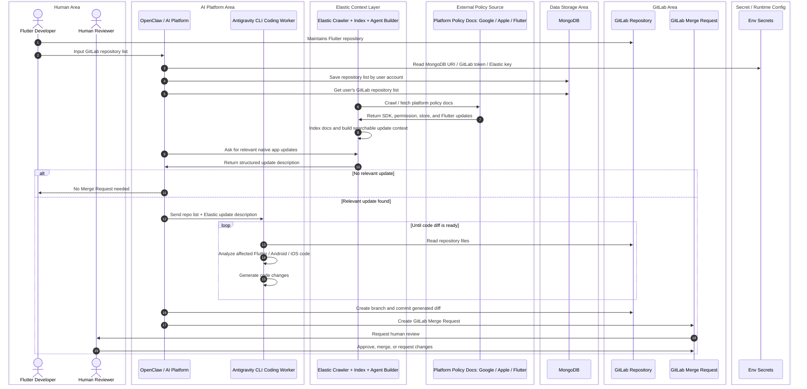
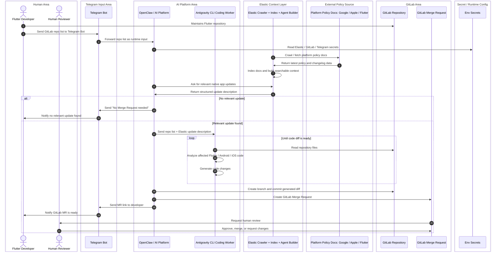

# PRD - AI Native Compliance Automation for Flutter Repositories

**Version:** 2.0  
**Date:** 2026-05-23  
**Primary hackathon stack:** OpenClaw, Antigravity CLI, Elastic, GitLab, Telegram Bot
**Ideal stack extension:** MongoDB for account-based repository persistence

## 1. Product summary

This product helps Flutter developers keep their Android and iOS native project configuration up to date with platform policy changes from Google, Apple, and Flutter. A developer submits one or more GitLab repository URLs. The system checks the latest indexed platform policy context in Elastic, then OpenClaw delegates repository edits to Antigravity CLI as the coding worker. OpenClaw/GitLab automation then commits the generated diff and creates a GitLab Merge Request.

The final output is not a raw report and not an automatic merge. The final output is a **GitLab Merge Request reviewed by a human**.

## 2. Problem

Flutter developers often discover native platform changes late: target SDK changes, new permission behavior, App Store submission requirements, Gradle/Xcode compatibility requirements, and Flutter breaking changes. These issues can block publishing or waste engineering time. Existing solutions are mostly manual: read policy docs, inspect native folders, update files, run builds, and open MRs.

## 3. Target users

| User | Need |
|---|---|
| Flutter Developer | Submit repo list and receive MR when native policy changes require code updates. |
| Tech Lead / Maintainer | Review generated MR before merge. |
| Hackathon evaluator | See a clear Gemini/Antigravity coding-agent flow using OpenClaw, Elastic context, Telegram, and GitLab. |

## 4. Product goals

1. Let a developer submit GitLab repository URLs through Telegram for the hackathon MVP.
2. Use Elastic as the context layer for Google / Apple / Flutter policy docs.
3. Run Antigravity CLI as the coding worker that inspects repo code and makes native-compliance changes.
4. Create GitLab Merge Requests with explanation, affected files, and human-review requirement.
5. Keep private credentials out of public source code.

## 5. Non-goals

- No automatic merge to the default branch.
- No full production-grade policy guarantee in MVP.
- No broad crawling of the entire web; use selected platform-policy seed URLs.
- No MongoDB in the Telegram MVP flow.
- No direct user-facing raw code patch as the final deliverable.

## 6. Two product modes

### 6.1 Ideal mode - account-based repository list with MongoDB

Used when the product becomes more than a hackathon demo. The Flutter Developer inputs repo list once, OpenClaw stores it in MongoDB by user account, and future checks can retrieve the user repository list.

### 6.2 Hackathon MVP mode - Telegram runtime input, no MongoDB

Used for fast demo and simple user experience. The Flutter Developer sends repo list via Telegram. OpenClaw processes it immediately and does not persist repo list in MongoDB.

## 7. Core user flows

### 7.1 Telegram MVP flow

1. Flutter Developer sends `/check` command with GitLab repo URLs to Telegram Bot.
2. OpenClaw receives the Telegram input and extracts repo URLs.
3. OpenClaw asks Elastic for relevant native platform updates.
4. Elastic searches indexed Google / Apple / Flutter docs and returns a structured update description.
5. If no relevant update exists, OpenClaw replies in Telegram: `No Merge Request needed`.
6. If an update is relevant, OpenClaw sends repo list and update description to Antigravity CLI Coding Worker.
7. Antigravity CLI Coding Worker reads GitLab repository files and modifies code inside the cloned workspace.
8. OpenClaw/GitLab automation reviews the diff boundary, creates a branch, commits, and opens GitLab MR.
9. OpenClaw sends MR link back to the developer in Telegram.
10. Human Reviewer reviews, approves, merges, or requests changes in GitLab.

### 7.2 Ideal account-based flow

1. Developer inputs repo list in OpenClaw / platform UI.
2. OpenClaw saves repo list by user account to MongoDB.
3. OpenClaw loads repos by user account when check starts.
4. Elastic provides structured update context.
5. Antigravity CLI Coding Worker edits repos, then OpenClaw/GitLab automation creates GitLab MRs.

## 8. Functional requirements

| ID | Requirement | Priority |
|---|---|---|
| FR-01 | Accept one or more GitLab repo URLs from Telegram message. | Must |
| FR-02 | Query Elastic for latest relevant Google / Apple / Flutter policy updates. | Must |
| FR-03 | Return no-MR-needed response when no relevant update is found. | Must |
| FR-04 | Pass repo list and Elastic update description to Antigravity CLI Coding Worker. | Must |
| FR-05 | Antigravity CLI Coding Worker reads repository files and identifies affected Flutter / Android / iOS files. | Must |
| FR-06 | OpenClaw/GitLab automation creates branch, commits Antigravity-generated changes, and creates GitLab MR. | Must |
| FR-07 | MR description includes policy summary, affected files, code change summary, and human review note. | Must |
| FR-08 | Telegram Bot sends final MR link to developer. | Must |
| FR-09 | Store account-based repo list in MongoDB in ideal mode. | Should |
| FR-10 | Do not expose Elastic API key, GitLab token, Telegram token, or MongoDB URI in public repo. | Must |

## 9. User stories

- As a Flutter Developer, I can send repo URLs through Telegram so the tool can check if platform updates require code changes.
- As a Flutter Developer, I receive either “No MR needed” or a GitLab MR link.
- As a Maintainer, I can review the MR in GitLab before anything reaches the default branch.
- As a hackathon judge, I can see Elastic used as the policy context layer and Antigravity used as the coding agent.

## 10. Expected MR content

Each generated MR should include:

- Title: `chore(native-compliance): update Android/iOS config for latest platform requirement`
- Summary of policy update from Elastic.
- Affected files.
- Code changes made.
- Risk notes.
- Manual reviewer checklist.
- Clear statement: `Generated by PatchPilot Antigravity Coding Worker. Human review required.`

## 11. Success metrics

| Metric | Target for hackathon demo |
|---|---|
| Telegram command to MR creation | Under 5 minutes for small sample repo |
| MR contains useful explanation | 100% of generated MRs |
| Human merge required | 100% |
| Secrets leaked in repo | 0 |
| Elastic used for platform-policy context | Yes |
| Antigravity used for repository code changes | Yes |

## 12. Security requirements

- Store `ELASTIC_API_KEY`, `GITLAB_TOKEN`, and `TELEGRAM_BOT_TOKEN` as environment secrets.
- Store Antigravity authentication/configuration as runtime secrets or user-scoped CLI config.
- Never commit `.env` with real values.
- Use `.env.example` for documentation.
- GitLab token should have minimum required scope for target repositories.
- Telegram Bot should use allowlist or restricted group configuration for demo.
- MR generation must be branch-based and human-reviewed.

## 13. Risks and mitigations

| Risk | Mitigation |
|---|---|
| Elastic index has stale policy docs | Add crawl timestamp and show source URLs in MR. |
| Antigravity modifies wrong files | Restrict the coding worker to the cloned repo workspace and review diff before commit. |
| GitLab token leaks | Use environment secrets and never log token values. |
| Generated MR fails CI | Mark MR as draft or include validation status. |
| Telegram command abused | Use Telegram allowlist / group allowlist. |

## 14. Acceptance criteria

- Developer can send repo list via Telegram.
- OpenClaw receives and processes the repo list.
- Elastic returns structured policy update context from indexed docs.
- Antigravity CLI Coding Worker creates code changes in a cloned workspace.
- OpenClaw/GitLab automation commits the generated diff to a GitLab branch.
- GitLab Merge Request is created.
- Developer receives MR link in Telegram.
- Human Reviewer is the final decision-maker.

## References

- OpenClaw Tools: https://docs.openclaw.ai/tools
- OpenClaw Skills: https://docs.openclaw.ai/tools/skills
- OpenClaw Telegram channel: https://docs.openclaw.ai/channels/telegram
- OpenClaw channels overview: https://docs.openclaw.ai/channels
- OpenClaw plugin bundles: https://docs.openclaw.ai/plugins/bundles
- Antigravity CLI overview: https://antigravity.google/docs/cli-overview
- Antigravity CLI features: https://antigravity.google/docs/cli-features
- Elastic Agent Builder: https://www.elastic.co/docs/explore-analyze/ai-features/elastic-agent-builder
- Elastic Web Crawler: https://www.elastic.co/guide/en/enterprise-search/current/crawler.html
- Elastic Open Crawler: https://github.com/elastic/crawler
- GitLab Merge Requests API: https://docs.gitlab.com/api/merge_requests/
- GitLab Branches API: https://docs.gitlab.com/api/branches/
- GitLab Commits API: https://docs.gitlab.com/api/commits/
- MongoDB databases and collections: https://www.mongodb.com/docs/manual/core/databases-and-collections/
- MongoDB connection strings: https://www.mongodb.com/docs/manual/reference/connection-string/
- Telegram Bot API: https://core.telegram.org/bots/api
