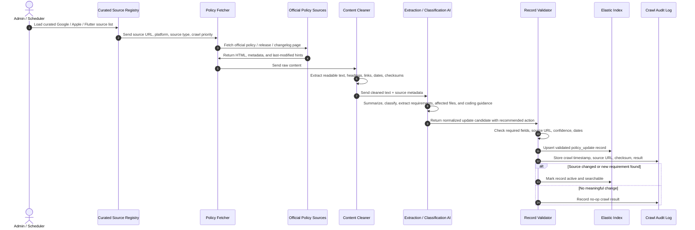
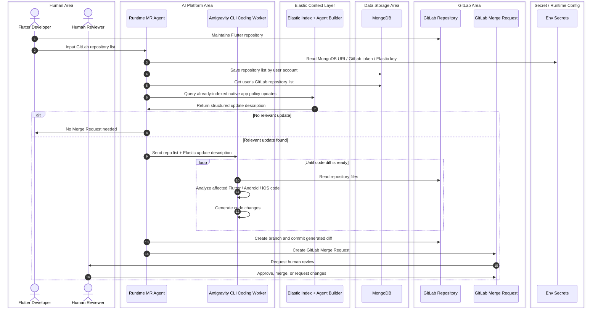
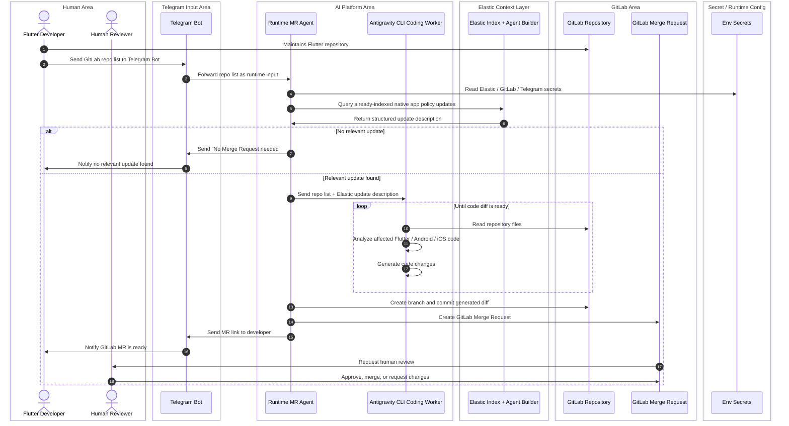

# TRD - AI Native Compliance Automation for Flutter Repositories

**Version:** 2.0  
**Date:** 2026-05-23  
**Primary implementation:** Telegram MVP without MongoDB  
**Scalable implementation:** Account-based mode with MongoDB

## 1. Technical summary

The system uses one isolated OpenClaw runtime with two dedicated agents. The PatchPilot Runtime MR Agent is user-facing through Telegram and creates GitLab Merge Requests. The Policy Context Agent is internal/background and maintains Elastic policy context. Antigravity CLI is the coding worker invoked only by the Runtime MR Agent. Elastic is the platform-policy context layer, and GitLab is the source-code and Merge Request system. The hackathon MVP avoids MongoDB by receiving repo URLs directly through Telegram and processing them as runtime input. The ideal mode adds MongoDB to persist repository lists by user account.

## 2. Architecture principles

For a concise platform view, see
[`docs/openclaw-platform-architecture.md`](docs/openclaw-platform-architecture.md).

1. **One OpenClaw runtime, two agents.** Runtime MR Agent handles Telegram/repo/MR work; Policy Context Agent handles crawl/extract/index work.
2. **Elastic owns policy context.** Google / Apple / Flutter docs are crawled/fetched by the Policy Context Agent and indexed in Elasticsearch.
3. **Runtime MR Agent orchestrates repo remediation.** It receives Telegram messages, queries Elastic read-only, invokes Antigravity CLI, inspects the diff, and creates the GitLab MR.
4. **Policy Context Agent maintains Elastic.** It fetches curated official sources, uses AI for extraction/classification, validates records, and upserts Elastic.
5. **Antigravity CLI Coding Worker owns repository edits.** It reads repo files and generates code changes inside a cloned workspace; Runtime MR Agent handles branch, commit, push, and MR creation.
6. **GitLab owns source control and review.** Output is GitLab Merge Request, never direct merge.
7. **Secrets stay outside source code.** Tokens and API keys are split by agent role and stored as environment/runtime secrets.

## 3. Sequence diagrams

### 3.0 OpenClaw platform architecture - two-agent runtime

```txt
OpenClaw Gateway
├── Agent 1: PatchPilot Runtime MR Agent
│   ├── Telegram channel
│   ├── Elastic read/query tool
│   ├── GitLab clone/API tools
│   ├── Antigravity CLI exec wrapper
│   └── GitLab MR notification flow
│
└── Agent 2: Policy Context Agent
    ├── Scheduled/manual crawl trigger
    ├── Curated source registry
    ├── Policy fetcher / cleaner
    ├── Extraction/classification AI
    ├── Elastic write/upsert tool
    └── Crawl audit log
```

Agent separation:

| Agent | Trigger | Responsibilities | Allowed secrets/tools | Must not do |
|---|---|---|---|---|
| PatchPilot Runtime MR Agent | Telegram `/check`, future dashboard/API scan | Query Elastic, clone repo, build Antigravity payload, invoke Antigravity, inspect diff, create MR, notify Telegram | Telegram token, GitLab token, Elastic read key, Antigravity auth, workspace filesystem, git/exec | Crawl policy docs, write Elastic policy records |
| Policy Context Agent | Schedule, manual admin trigger | Crawl official sources, clean text, extract/classify requirements, validate records, upsert Elastic, write audit logs | Elastic write key, curated source registry, web fetch/crawler, extraction model | Clone user repos, invoke Antigravity, create GitLab MRs |

### 3.1 Policy ingestion - scheduled crawl to Elastic

This flow is separate from Telegram `/check`. It crawls curated official
Google / Apple / Flutter sources, uses AI only for extraction/classification,
validates the normalized record, and stores it in Elastic.

[Standalone diagram](diagrams/sequence-policy-ingestion.md)



### 3.2 Ideal mode - with MongoDB repository persistence

[Standalone diagram](diagrams/sequence-ideal-mongodb.md)



### 3.3 Hackathon MVP - Telegram input, no MongoDB

[Standalone diagram](diagrams/sequence-telegram-mvp.md)



## 4. Technology inventory and responsibilities

### 4.1 OpenClaw platform

OpenClaw runs the PatchPilot platform as one isolated runtime with multiple agents.
The agents share gateway infrastructure but do not share responsibilities or
secrets.

| Capability / tool | Function in this project | Notes |
|---|---|---|
| Agent registry | Defines `patchpilot-runtime` and `policy-context` agents. | Keep prompts, tools, schedules, and secrets scoped by agent. |
| Telegram channel | Routes `/check` messages to Runtime MR Agent and sends MR link back to developer. | OpenClaw supports channels and identifies Telegram as a fast setup with bot token. |
| Tools layer | Lets agents invoke typed functions such as `exec`, `web_fetch`, `message`, and custom Elastic/GitLab tools. | Runtime MR Agent and Policy Context Agent should receive different tool allowlists. |
| Skills | Defines reusable workflows and guardrails. | Use `patchpilot-runtime-agent` and `policy-context-agent` skills. |
| Plugins / bundles | Package channel integrations, model providers, MCP tools, hooks, or skills. | Useful if GitLab or Elastic integrations are packaged as plugins. |
| Gateway | Runs OpenClaw as the message and agent runtime. | Required for Telegram bot routing. |
| Message tool | Sends progress, no-action result, or MR link to Telegram. | Used for developer notification. |
| Exec / terminal tool | Runtime MR Agent runs git, Antigravity CLI, validation commands, or helper scripts if enabled. | Should be gated or sandboxed. Policy Context Agent should not get GitLab repo write tools. |
| Web fetch/crawler tool | Policy Context Agent fetches curated official sources. | Runtime MR Agent should not crawl policy docs during `/check`. |
| File read/edit/apply_patch pattern | Used mainly for orchestration files, generated prompts, diff inspection, and policy source registry files. | Antigravity should own source edits in the cloned target repo. |
| Agent workspace | Temporary working directory for cloned GitLab repos. | Clean up after MR creation. |
| Access control | Telegram allowlist, group allowlist, and activation/mention policy. | Prevent random users from triggering code changes. |

### 4.1.1 Runtime MR Agent

| Responsibility | Detail |
|---|---|
| Trigger | Telegram `/check` with one or more GitLab repo URLs. |
| Elastic access | Read/query only. |
| GitLab access | Clone/fetch repo, create branch, commit, push, create MR. |
| Antigravity access | Invoke CLI inside cloned workspace only. |
| Output | No-action Telegram response or GitLab MR link. |

### 4.1.2 Policy Context Agent

| Responsibility | Detail |
|---|---|
| Trigger | Schedule, manual admin command, or deployment-time ingestion command. |
| Source access | Curated official Google / Apple / Flutter URLs only. |
| Elastic access | Write/upsert validated policy records. |
| AI role | Summarize, classify, extract requirements, define generic coding guidance, score relevance. |
| Output | `platform_policy_updates` records and crawl audit logs. |

### 4.2 Elastic

| Component / tool | Function in this project | Notes |
|---|---|---|
| Elastic Web Crawler or Open Crawler | Crawls/fetches platform policy docs from Google / Apple / Flutter. | Elastic docs describe web crawler as discovering, extracting, and indexing searchable web content. |
| Elasticsearch Index | Stores cleaned platform policy documents and summaries. | Suggested index: `platform_policy_updates`. |
| Elastic Agent Builder | Searches indexed docs and returns structured update descriptions. | AI may summarize, classify, extract requirements, define coding guidance, and score relevance. It must not modify repos or create MRs. |
| Custom search / ES query tool | Finds latest relevant policy update by platform and date. | Could be semantic, keyword, or hybrid query. |
| Enrichment pipeline | Normalizes crawled docs into `platform`, `requirement`, `affected_files`, `severity`, `source_url`. | Can be simple script for MVP. |
| Elastic read/write API keys | Programmatic access to Elastic APIs / Agent Builder. | Keep read and write credentials split by agent role. |

### 4.3 GitLab

| GitLab capability / API | Function in this project | Notes |
|---|---|---|
| GitLab Repository | Source of Flutter project code. | Repos are maintained by Flutter Developer. |
| Personal Access Token / Project Access Token | Authenticates read/write operations. | Use minimum required scope; keep secret. |
| Repository clone / file read | Lets Antigravity CLI Coding Worker inspect `pubspec.yaml`, `android/`, `ios/`, CI config. | Can use `git clone` or GitLab repository/file APIs. |
| Branches API / git branch | Creates feature branch for remediation. | Branch name example: `ai/native-compliance-<date>`. |
| Commits API / git commit | Commits generated code changes. | Commit message should mention PatchPilot native compliance update. |
| Merge Requests API | Creates GitLab MR with title, description, source branch, target branch. | GitLab API supports MR automation and code-review integrations. |
| Merge Request approvals | Human reviewer can approve or request changes. | Automation must not auto-approve itself. |
| CI pipeline, optional | Validates `flutter analyze`, `flutter test`, or build commands. | MVP can include status in MR if available. |

### 4.4 Telegram

| Telegram capability | Function in this project | Notes |
|---|---|---|
| Telegram Bot | Main hackathon input channel. | Developer sends repo list. |
| Bot token | Authenticates bot access. | Store as `TELEGRAM_BOT_TOKEN` env secret. |
| DM or group chat | Input surface for `/check` command. | Use allowlist for safety. |
| Message send | Sends no-action result or MR link. | Can be via OpenClaw Telegram channel. |
| Allowed sender IDs | Restricts who can trigger code automation. | OpenClaw Telegram config supports allowlist patterns. |

### 4.5 MongoDB - ideal mode only

| MongoDB component | Function in this project | Notes |
|---|---|---|
| `repositories` collection | Stores GitLab repo URLs by user account. | Used only in ideal account-based mode. |
| `users` collection, optional | Maps Telegram/OpenClaw user to account. | Not required in hackathon MVP. |
| Connection string | Connects OpenClaw/backend helper to database. | Store as `MONGODB_URI`; do not commit. |
| Query by user account | Loads registered repositories for a specific user. | Replaces Telegram runtime repo list in ideal mode. |

### 4.6 Antigravity CLI Coding Worker

| Capability | Function |
|---|---|
| Understand structured update context | Receives Elastic policy description and cloned repo workspace path. |
| Inspect repo | Reads project files in the cloned workspace and identifies native config impact. |
| Generate changes | Updates files such as `android/app/build.gradle`, `AndroidManifest.xml`, `ios/Podfile`, `Info.plist`, or CI config if relevant. |
| Validation loop | Runs or requests lightweight validation when available. |
| Diff output | Leaves a reviewable working-tree diff for OpenClaw to inspect. |
| Scope control | Operates only inside the cloned target repository workspace. |

## 5. Data models

### 5.1 Elastic index: `platform_policy_updates`

```json
{
  "source": "google_android | apple_ios | flutter_docs",
  "platform": "android | ios | flutter",
  "title": "Target API level requirements for Google Play apps",
  "url": "https://developer.android.com/...",
  "content": "Cleaned text from policy document",
  "summary": "Short normalized update description",
  "detected_requirement": "targetSdk update required",
  "affected_files": ["android/app/build.gradle", "ios/Info.plist"],
  "severity": "info | warning | publishing_blocker",
  "last_crawled_at": "2026-05-23T00:00:00Z"
}
```

### 5.2 MongoDB ideal-mode collection: `repositories`

```json
{
  "user_id": "telegram:123456789",
  "provider": "gitlab",
  "repo_url": "https://gitlab.com/company/flutter-app",
  "default_branch": "main",
  "platforms": ["android", "ios"],
  "created_at": "2026-05-23T00:00:00Z"
}
```

## 6. Telegram command design

### 6.1 MVP command

```text
/check
https://gitlab.com/company/flutter-app-1
https://gitlab.com/company/flutter-app-2
```

### 6.2 Optional structured command

```text
/check native-compliance
repos:
- https://gitlab.com/company/flutter-app-1
- https://gitlab.com/company/flutter-app-2
platforms:
- android
- ios
```

### 6.3 Expected bot responses

```text
No relevant native platform update found. No Merge Request needed.
```

or:

```text
GitLab Merge Request created:
https://gitlab.com/company/flutter-app/-/merge_requests/123
Human review required before merge.
```

## 7. GitLab MR template

```markdown
# Native Compliance Update

Generated by PatchPilot Antigravity Coding Worker. Human review required.

## Policy Context
- Source: Elastic indexed Google / Apple / Flutter docs
- Requirement: <requirement summary>
- Severity: <severity>

## Changes
- <file>: <change summary>

## Review Checklist
- [ ] Confirm platform requirement is relevant
- [ ] Review native Android/iOS changes
- [ ] Run CI or local build
- [ ] Merge only after human approval
```

## 8. Security and secret management

Required env secrets:

```env
TELEGRAM_BOT_TOKEN=
GITLAB_TOKEN=
ELASTICSEARCH_URL=
ELASTIC_READ_API_KEY=
ELASTIC_WRITE_API_KEY=
ANTIGRAVITY_API_KEY=
MONGODB_URI= # ideal mode only
```

Rules:

- Never commit real `.env` values.
- Provide only `.env.example` in public repo.
- Mask GitLab CI variables if used.
- Log only token names, never token values.
- Use least-privilege GitLab token.
- Restrict Telegram input via allowlist.
- Keep Antigravity CLI auth/config scoped to the PatchPilot container/user.
- Give Runtime MR Agent only Elastic read access.
- Give Policy Context Agent only Elastic write/upsert access and no GitLab token.

## 9. Implementation plan

### Phase 1 - Telegram MVP

1. Configure one isolated OpenClaw runtime for PatchPilot.
2. Create `policy-context` agent for scheduled/manual Elastic ingestion.
3. Configure curated source registry and Elastic write/upsert flow.
4. Create `patchpilot-runtime` agent for Telegram `/check`.
5. Configure OpenClaw Telegram channel and `/check` command parsing skill.
6. Build Elastic read query/tool for Runtime MR Agent.
7. Install and authenticate Antigravity CLI in the PatchPilot runtime.
8. Implement Antigravity task prompt generation for Flutter native compliance.
9. Implement diff inspection and safety checks before commit.
10. Implement GitLab read/branch/commit/MR operations.
11. Send final MR link to Telegram.

### Phase 2 - Ideal account-based mode

1. Add MongoDB repository storage.
2. Add user account mapping.
3. Add `get repositories by user account` flow.
4. Add scheduled or manual scans for stored repos.
5. Add scan history if useful.

## 10. Testing strategy

| Test | Expected result |
|---|---|
| Telegram unauthorized user | Bot rejects or ignores request. |
| Policy Context Agent scheduled crawl | Official docs are fetched, normalized, validated, and upserted into Elastic. |
| Valid repo list, no relevant Elastic update | Bot returns no-MR-needed. |
| Valid repo list, relevant Android update | Antigravity creates code diff; Runtime MR Agent commits branch and creates GitLab MR. |
| Invalid repo URL | Bot reports invalid input. |
| Missing GitLab token | Tool fails safely without exposing secret. |
| Elastic unavailable | Bot reports context provider unavailable. |
| Generated MR | Contains policy summary, affected files, human review note. |

## 11. Failure handling

| Failure | Handling |
|---|---|
| Elastic index empty | Return “policy context unavailable” and do not modify repo. |
| Policy crawl fails | Keep last valid Elastic records and write audit failure. |
| GitLab repo inaccessible | Return error to Telegram. |
| Antigravity cannot determine safe fix | Create no MR; return explanation. |
| Antigravity CLI unavailable | Stop before modifying repo and report coding worker unavailable. |
| Commit fails | Stop and report failure. |
| MR creation fails | Keep branch and report branch link if available. |

## 12. Open questions

- Should MVP run CI before MR creation or after MR creation?
- Should Telegram command allow platform filter, such as Android-only?
- Should generated MR be marked Draft by default?
- Should Elastic crawler run scheduled or manually before each demo?
- Should OpenClaw commit through local Git CLI or the GitLab Commits API after Antigravity generates the diff?
- Which Antigravity CLI auth method will be used in the final VPS/container?


## References

- OpenClaw Tools: https://docs.openclaw.ai/tools
- OpenClaw Skills: https://docs.openclaw.ai/tools/skills
- OpenClaw Telegram channel: https://docs.openclaw.ai/channels/telegram
- OpenClaw channels overview: https://docs.openclaw.ai/channels
- OpenClaw plugin bundles: https://docs.openclaw.ai/plugins/bundles
- Antigravity CLI overview: https://antigravity.google/docs/cli-overview
- Antigravity CLI features: https://antigravity.google/docs/cli-features
- Elastic Agent Builder: https://www.elastic.co/docs/explore-analyze/ai-features/elastic-agent-builder
- Elastic Web Crawler: https://www.elastic.co/guide/en/enterprise-search/current/crawler.html
- Elastic Open Crawler: https://github.com/elastic/crawler
- GitLab Merge Requests API: https://docs.gitlab.com/api/merge_requests/
- GitLab Branches API: https://docs.gitlab.com/api/branches/
- GitLab Commits API: https://docs.gitlab.com/api/commits/
- MongoDB databases and collections: https://www.mongodb.com/docs/manual/core/databases-and-collections/
- MongoDB connection strings: https://www.mongodb.com/docs/manual/reference/connection-string/
- Telegram Bot API: https://core.telegram.org/bots/api
