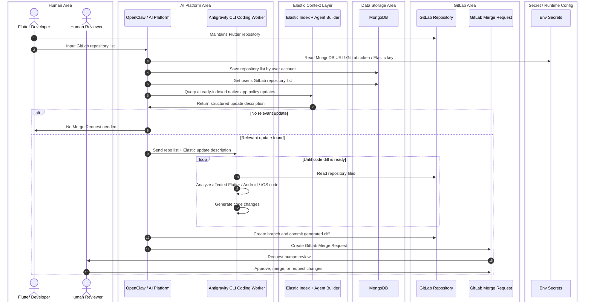
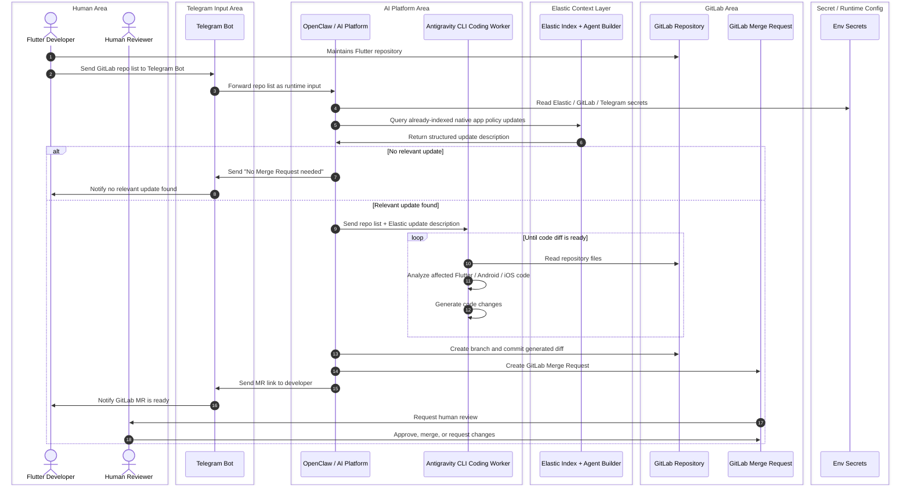

# TRD - AI Native Compliance Automation for Flutter Repositories

**Version:** 2.0  
**Date:** 2026-05-23  
**Primary implementation:** Telegram MVP without MongoDB  
**Scalable implementation:** Account-based mode with MongoDB

## 1. Technical summary

The system uses OpenClaw as the orchestration platform and Telegram interface, Antigravity CLI as the coding worker, Elastic as the platform-policy context layer, and GitLab as the source-code and Merge Request system. The hackathon MVP avoids MongoDB by receiving repo URLs directly through Telegram and processing them as runtime input. The ideal mode adds MongoDB to persist repository lists by user account.

## 2. Architecture principles

1. **Elastic owns policy context.** Google / Apple / Flutter docs are crawled/fetched and indexed in Elasticsearch.
2. **OpenClaw orchestrates the agent flow.** It receives messages, calls tools, queries Elastic, invokes Antigravity CLI, and creates the GitLab MR.
3. **Antigravity CLI Coding Worker owns repository edits.** It reads repo files and generates code changes inside a cloned workspace; OpenClaw handles branch, commit, push, and MR creation.
4. **GitLab owns source control and review.** Output is GitLab Merge Request, never direct merge.
5. **Secrets stay outside source code.** All tokens and API keys are environment/runtime secrets.

## 3. Sequence diagrams

### 3.1 Ideal mode - with MongoDB repository persistence

[Standalone diagram](diagrams/sequence-ideal-mongodb.md)



### 3.2 Hackathon MVP - Telegram input, no MongoDB

[Standalone diagram](diagrams/sequence-telegram-mvp.md)



## 4. Technology inventory and responsibilities

### 4.1 OpenClaw

| Capability / tool | Function in this project | Notes |
|---|---|---|
| Telegram channel | Receives `/check` messages and sends MR link back to developer. | OpenClaw supports channels and identifies Telegram as a fast setup with bot token. |
| Tools layer | Lets the agent invoke typed functions such as `exec`, `browser`, `web_search`, and `message`. | Used for shell commands, outbound message, search/fetch if enabled. |
| Skills | Defines PatchPilot orchestration rules, diff boundaries, and how to call Antigravity CLI safely. | Create workspace skill: `patchpilot-orchestrator`. |
| Plugins / bundles | Package channel integrations, model providers, MCP tools, hooks, or skills. | Useful if GitLab or Elastic integrations are packaged as plugins. |
| Gateway | Runs OpenClaw as the message and agent runtime. | Required for Telegram bot routing. |
| Message tool | Sends progress, no-action result, or MR link to Telegram. | Used for developer notification. |
| Exec / terminal tool | Runs git, Antigravity CLI, validation commands, or helper scripts if enabled. | Should be gated or sandboxed. |
| File read/edit/apply_patch pattern | Used mainly for orchestration files, generated prompts, and diff inspection. | Antigravity should own source edits in the cloned target repo. |
| Agent workspace | Temporary working directory for cloned GitLab repos. | Clean up after MR creation. |
| Access control | Telegram allowlist, group allowlist, and activation/mention policy. | Prevent random users from triggering code changes. |

### 4.2 Elastic

| Component / tool | Function in this project | Notes |
|---|---|---|
| Elastic Web Crawler or Open Crawler | Crawls/fetches platform policy docs from Google / Apple / Flutter. | Elastic docs describe web crawler as discovering, extracting, and indexing searchable web content. |
| Elasticsearch Index | Stores cleaned platform policy documents and summaries. | Suggested index: `platform_policy_updates`. |
| Elastic Agent Builder | Searches indexed docs and returns structured update descriptions. | AI may summarize, classify, extract requirements, and score relevance. It must not modify repos or create MRs. |
| Custom search / ES query tool | Finds latest relevant policy update by platform and date. | Could be semantic, keyword, or hybrid query. |
| Enrichment pipeline | Normalizes crawled docs into `platform`, `requirement`, `affected_files`, `severity`, `source_url`. | Can be simple script for MVP. |
| Elastic API key | Programmatic access to Elastic APIs / Agent Builder. | Keep in env secrets. |

### 4.3 GitLab

| GitLab capability / API | Function in this project | Notes |
|---|---|---|
| GitLab Repository | Source of Flutter project code. | Repos are maintained by Flutter Developer. |
| Personal Access Token / Project Access Token | Authenticates read/write operations. | Use minimum required scope; keep secret. |
| Repository clone / file read | Lets Antigravity CLI Coding Worker inspect `pubspec.yaml`, `android/`, `ios/`, CI config. | Can use `git clone` or GitLab repository/file APIs. |
| Branches API / git branch | Creates feature branch for remediation. | Branch name example: `ai/native-compliance-<date>`. |
| Commits API / git commit | Commits generated code changes. | Commit message should mention PatchPilot native compliance update. |
| Merge Requests API | Creates GitLab MR with title, description, source branch, target branch. | GitLab API supports MR automation and code-review integrations. |
| Merge Request approvals | Human reviewer can approve or request changes. | Automation must not auto-approve itself. |
| CI pipeline, optional | Validates `flutter analyze`, `flutter test`, or build commands. | MVP can include status in MR if available. |

### 4.4 Telegram

| Telegram capability | Function in this project | Notes |
|---|---|---|
| Telegram Bot | Main hackathon input channel. | Developer sends repo list. |
| Bot token | Authenticates bot access. | Store as `TELEGRAM_BOT_TOKEN` env secret. |
| DM or group chat | Input surface for `/check` command. | Use allowlist for safety. |
| Message send | Sends no-action result or MR link. | Can be via OpenClaw Telegram channel. |
| Allowed sender IDs | Restricts who can trigger code automation. | OpenClaw Telegram config supports allowlist patterns. |

### 4.5 MongoDB - ideal mode only

| MongoDB component | Function in this project | Notes |
|---|---|---|
| `repositories` collection | Stores GitLab repo URLs by user account. | Used only in ideal account-based mode. |
| `users` collection, optional | Maps Telegram/OpenClaw user to account. | Not required in hackathon MVP. |
| Connection string | Connects OpenClaw/backend helper to database. | Store as `MONGODB_URI`; do not commit. |
| Query by user account | Loads registered repositories for a specific user. | Replaces Telegram runtime repo list in ideal mode. |

### 4.6 Antigravity CLI Coding Worker

| Capability | Function |
|---|---|
| Understand structured update context | Receives Elastic policy description and cloned repo workspace path. |
| Inspect repo | Reads project files in the cloned workspace and identifies native config impact. |
| Generate changes | Updates files such as `android/app/build.gradle`, `AndroidManifest.xml`, `ios/Podfile`, `Info.plist`, or CI config if relevant. |
| Validation loop | Runs or requests lightweight validation when available. |
| Diff output | Leaves a reviewable working-tree diff for OpenClaw to inspect. |
| Scope control | Operates only inside the cloned target repository workspace. |

## 5. Data models

### 5.1 Elastic index: `platform_policy_updates`

```json
{
  "source": "google_android | apple_ios | flutter_docs",
  "platform": "android | ios | flutter",
  "title": "Target API level requirements for Google Play apps",
  "url": "https://developer.android.com/...",
  "content": "Cleaned text from policy document",
  "summary": "Short normalized update description",
  "detected_requirement": "targetSdk update required",
  "affected_files": ["android/app/build.gradle", "ios/Info.plist"],
  "severity": "info | warning | publishing_blocker",
  "last_crawled_at": "2026-05-23T00:00:00Z"
}
```

### 5.2 MongoDB ideal-mode collection: `repositories`

```json
{
  "user_id": "telegram:123456789",
  "provider": "gitlab",
  "repo_url": "https://gitlab.com/company/flutter-app",
  "default_branch": "main",
  "platforms": ["android", "ios"],
  "created_at": "2026-05-23T00:00:00Z"
}
```

## 6. Telegram command design

### 6.1 MVP command

```text
/check
https://gitlab.com/company/flutter-app-1
https://gitlab.com/company/flutter-app-2
```

### 6.2 Optional structured command

```text
/check native-compliance
repos:
- https://gitlab.com/company/flutter-app-1
- https://gitlab.com/company/flutter-app-2
platforms:
- android
- ios
```

### 6.3 Expected bot responses

```text
No relevant native platform update found. No Merge Request needed.
```

or:

```text
GitLab Merge Request created:
https://gitlab.com/company/flutter-app/-/merge_requests/123
Human review required before merge.
```

## 7. GitLab MR template

```markdown
# Native Compliance Update

Generated by PatchPilot Antigravity Coding Worker. Human review required.

## Policy Context
- Source: Elastic indexed Google / Apple / Flutter docs
- Requirement: <requirement summary>
- Severity: <severity>

## Changes
- <file>: <change summary>

## Review Checklist
- [ ] Confirm platform requirement is relevant
- [ ] Review native Android/iOS changes
- [ ] Run CI or local build
- [ ] Merge only after human approval
```

## 8. Security and secret management

Required env secrets:

```env
TELEGRAM_BOT_TOKEN=
GITLAB_TOKEN=
ELASTICSEARCH_URL=
ELASTIC_API_KEY=
ANTIGRAVITY_API_KEY=
MONGODB_URI= # ideal mode only
```

Rules:

- Never commit real `.env` values.
- Provide only `.env.example` in public repo.
- Mask GitLab CI variables if used.
- Log only token names, never token values.
- Use least-privilege GitLab token.
- Restrict Telegram input via allowlist.
- Keep Antigravity CLI auth/config scoped to the PatchPilot container/user.

## 9. Implementation plan

### Phase 1 - Telegram MVP

1. Configure OpenClaw Telegram channel.
2. Create `/check` command parsing skill.
3. Configure Elastic crawler / fetcher for selected platform docs.
4. Build Elastic index and Agent Builder query/tool.
5. Install and authenticate Antigravity CLI in the PatchPilot runtime.
6. Implement Antigravity task prompt generation for Flutter native compliance.
7. Implement diff inspection and safety checks before commit.
8. Implement GitLab read/branch/commit/MR operations.
9. Send final MR link to Telegram.

### Phase 2 - Ideal account-based mode

1. Add MongoDB repository storage.
2. Add user account mapping.
3. Add `get repositories by user account` flow.
4. Add scheduled or manual scans for stored repos.
5. Add scan history if useful.

## 10. Testing strategy

| Test | Expected result |
|---|---|
| Telegram unauthorized user | Bot rejects or ignores request. |
| Valid repo list, no relevant Elastic update | Bot returns no-MR-needed. |
| Valid repo list, relevant Android update | Antigravity creates code diff; OpenClaw commits branch and creates GitLab MR. |
| Invalid repo URL | Bot reports invalid input. |
| Missing GitLab token | Tool fails safely without exposing secret. |
| Elastic unavailable | Bot reports context provider unavailable. |
| Generated MR | Contains policy summary, affected files, human review note. |

## 11. Failure handling

| Failure | Handling |
|---|---|
| Elastic index empty | Return “policy context unavailable” and do not modify repo. |
| GitLab repo inaccessible | Return error to Telegram. |
| Antigravity cannot determine safe fix | Create no MR; return explanation. |
| Antigravity CLI unavailable | Stop before modifying repo and report coding worker unavailable. |
| Commit fails | Stop and report failure. |
| MR creation fails | Keep branch and report branch link if available. |

## 12. Open questions

- Should MVP run CI before MR creation or after MR creation?
- Should Telegram command allow platform filter, such as Android-only?
- Should generated MR be marked Draft by default?
- Should Elastic crawler run scheduled or manually before each demo?
- Should OpenClaw commit through local Git CLI or the GitLab Commits API after Antigravity generates the diff?
- Which Antigravity CLI auth method will be used in the final VPS/container?


## References

- OpenClaw Tools: https://docs.openclaw.ai/tools
- OpenClaw Skills: https://docs.openclaw.ai/tools/skills
- OpenClaw Telegram channel: https://docs.openclaw.ai/channels/telegram
- OpenClaw channels overview: https://docs.openclaw.ai/channels
- OpenClaw plugin bundles: https://docs.openclaw.ai/plugins/bundles
- Antigravity CLI overview: https://antigravity.google/docs/cli-overview
- Antigravity CLI features: https://antigravity.google/docs/cli-features
- Elastic Agent Builder: https://www.elastic.co/docs/explore-analyze/ai-features/elastic-agent-builder
- Elastic Web Crawler: https://www.elastic.co/guide/en/enterprise-search/current/crawler.html
- Elastic Open Crawler: https://github.com/elastic/crawler
- GitLab Merge Requests API: https://docs.gitlab.com/api/merge_requests/
- GitLab Branches API: https://docs.gitlab.com/api/branches/
- GitLab Commits API: https://docs.gitlab.com/api/commits/
- MongoDB databases and collections: https://www.mongodb.com/docs/manual/core/databases-and-collections/
- MongoDB connection strings: https://www.mongodb.com/docs/manual/reference/connection-string/
- Telegram Bot API: https://core.telegram.org/bots/api
