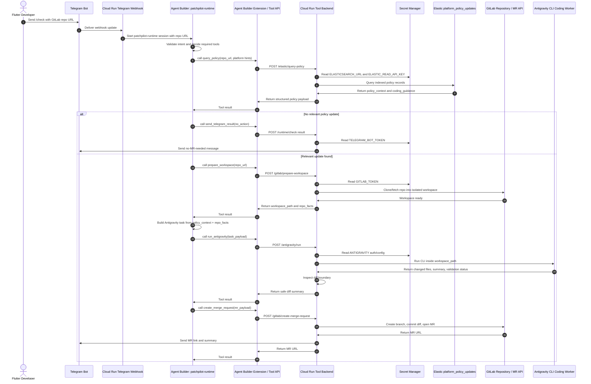

# Sequence Diagram - Agent Builder to Cloud Run Tools

This sequence shows the detailed runtime tool boundary. Agent Builder owns
reasoning and tool selection. Cloud Run owns side-effecting execution: Elastic
queries, GitLab workspace operations, Antigravity CLI execution, MR creation,
and Telegram notification.

## Tool Boundary

Agent Builder should not clone repositories, execute Antigravity, commit code,
or hold long-lived partner secrets directly. Those actions belong in Cloud Run.

Cloud Run endpoints should return structured JSON so Agent Builder can reason
over tool results without needing filesystem access.

