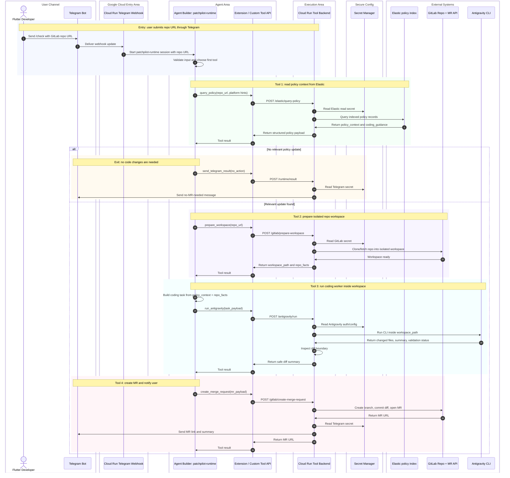

# Sequence Diagram - Runtime Agent Tool Execution

This is the detailed runtime sequence for Agent 1, `patchpilot-runtime`.

It sits inside the high-level Telegram MVP flow, exactly at this part:

```txt
Telegram Bot
-> Cloud Run Telegram Webhook
-> Agent Builder / patchpilot-runtime
-> Agent Builder Extension / Tool API
-> Cloud Run Tool Backend
-> Elastic / GitLab / Antigravity / Telegram
```

The key boundary is simple:

- Agent Builder decides what should happen next.
- Agent Builder Extension / Tool API is the callable bridge.
- Cloud Run Tool Backend performs side-effecting work.
- External systems are Elastic, GitLab, Antigravity, Secret Manager, and
  Telegram.



## Tool Boundary

Agent Builder should not clone repositories, execute Antigravity, commit code,
or hold long-lived partner secrets directly. Those actions belong in Cloud Run.

Cloud Run endpoints should return structured JSON so Agent Builder can reason
over tool results without needing filesystem access.

## Cloud Run Tool Endpoints

| Endpoint | Called by | Purpose |
|---|---|---|
| `POST /elastic/query-policy` | `query_policy` tool | Read indexed policy context from Elastic. |
| `POST /gitlab/prepare-workspace` | `prepare_workspace` tool | Clone/fetch repo and return `workspace_path` plus repo facts. |
| `POST /antigravity/run` | `run_antigravity` tool | Run Antigravity CLI inside the prepared workspace. |
| `POST /gitlab/create-merge-request` | `create_merge_request` tool | Create branch, commit diff, open GitLab MR. |
| `POST /runtime/result` | `send_telegram_result` tool | Send no-action or failure result to Telegram. |
