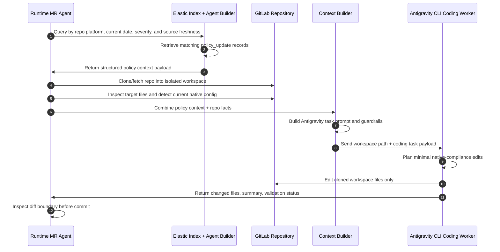

# Sequence Diagram - Elastic Context to Antigravity Coding Task

This flow defines how already-indexed Elastic policy records become the coding
task that Antigravity receives. It runs during `/check`, after policy ingestion
has already populated Elastic.

