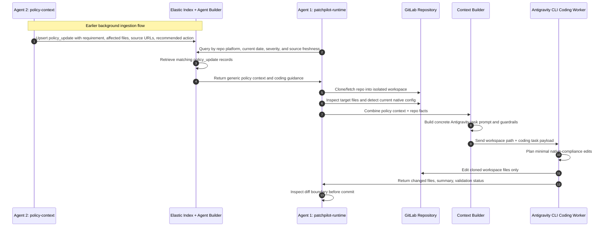

# Sequence Diagram - Elastic Policy Record to Antigravity Coding Task

This flow runs during `/check`, after the Policy Context Agent has already
crawled official sources and saved normalized policy records in Elastic.

The Policy Context Agent defines the generic policy requirement, likely affected
files, recommended action, source URLs, severity, and guardrail hints. The
Runtime MR Agent adds repo-specific facts, then builds the concrete Antigravity
coding task.

