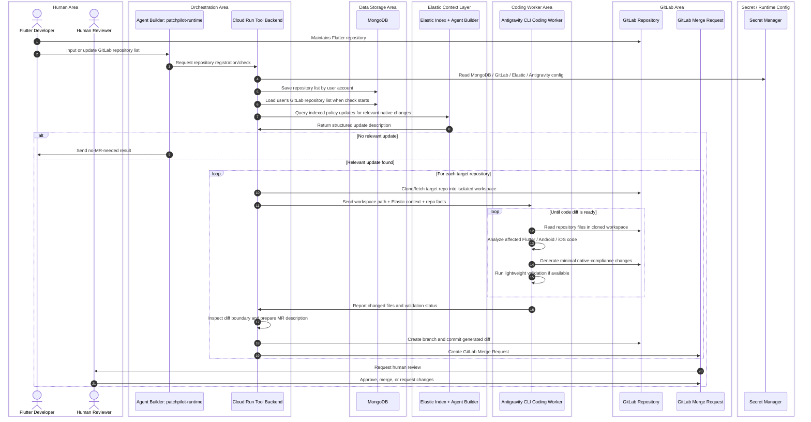

# Sequence Diagram - Ideal Mode with MongoDB and Antigravity

This is the scalable runtime product flow. Repository lists are stored by
user/account and can be reused for future manual or scheduled checks.

This flow queries policy records that were already indexed by the separate
[policy ingestion flow](sequence-policy-ingestion.md). It should not crawl the
internet for every repository scan.

