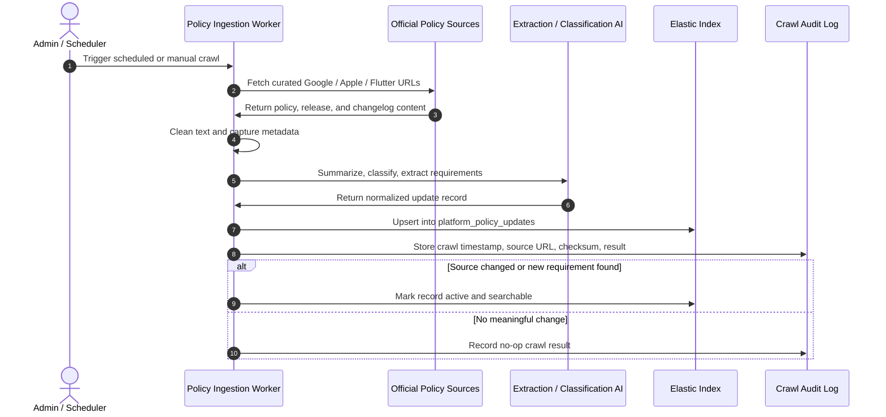

# Sequence Diagram - Policy Ingestion Flow

This flow runs separately from user-submitted repository checks. It crawls
official platform policy sources, normalizes them, and stores searchable records
in Elastic. It should run on a schedule or by manual admin trigger, not every
time a developer sends `/check`.

