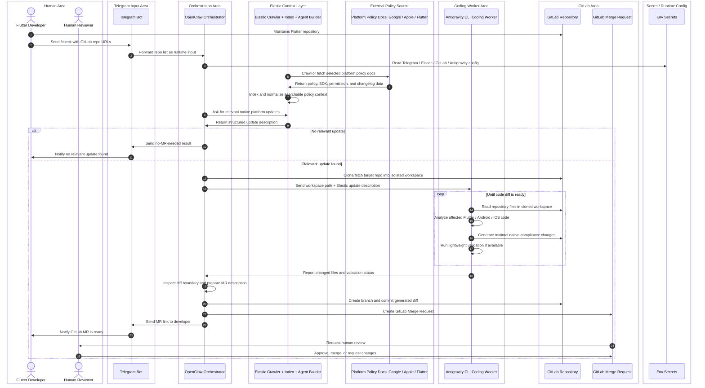

# Sequence Diagram - Telegram MVP with Antigravity

This is the hackathon MVP flow. Repository input is provided at runtime through
Telegram. No MongoDB persistence is required.

```mermaid
sequenceDiagram
    autonumber
    box Human Area
        actor Dev as Flutter Developer
        actor Reviewer as Human Reviewer
    end
    box Telegram Input Area
        participant Telegram as Telegram Bot
    end
    box Orchestration Area
        participant OpenClaw as OpenClaw Orchestrator
    end
    box Elastic Context Layer
        participant Elastic as Elastic Crawler + Index + Agent Builder
    end
    box External Policy Source
        participant Docs as Platform Policy Docs: Google / Apple / Flutter
    end
    box Coding Worker Area
        participant Antigravity as Antigravity CLI Coding Worker
    end
    box GitLab Area
        participant Repo as GitLab Repository
        participant MR as GitLab Merge Request
    end
    box Secret / Runtime Config
        participant Secrets as Env Secrets
    end

    Dev->>Repo: Maintains Flutter repository
    Dev->>Telegram: Send /check with GitLab repo URLs
    Telegram->>OpenClaw: Forward repo list as runtime input
    OpenClaw->>Secrets: Read Telegram / Elastic / GitLab / Antigravity config

    Elastic->>Docs: Crawl or fetch selected platform policy docs
    Docs->>Elastic: Return policy, SDK, permission, and changelog data
    Elastic->>Elastic: Index and normalize searchable policy context

    OpenClaw->>Elastic: Ask for relevant native platform updates
    Elastic->>OpenClaw: Return structured update description

    alt No relevant update
        OpenClaw->>Telegram: Send no-MR-needed result
        Telegram->>Dev: Notify no relevant update found
    else Relevant update found
        OpenClaw->>Repo: Clone/fetch target repo into isolated workspace
        OpenClaw->>Antigravity: Send workspace path + Elastic update description
        loop Until code diff is ready
            Antigravity->>Repo: Read repository files in cloned workspace
            Antigravity->>Antigravity: Analyze affected Flutter / Android / iOS code
            Antigravity->>Repo: Generate minimal native-compliance changes
            Antigravity->>Antigravity: Run lightweight validation if available
        end
        Antigravity->>OpenClaw: Report changed files and validation status
        OpenClaw->>OpenClaw: Inspect diff boundary and prepare MR description
        OpenClaw->>Repo: Create branch and commit generated diff
        OpenClaw->>MR: Create GitLab Merge Request
        OpenClaw->>Telegram: Send MR link to developer
        Telegram->>Dev: Notify GitLab MR is ready
        MR->>Reviewer: Request human review
        Reviewer->>MR: Approve, merge, or request changes
    end
```
