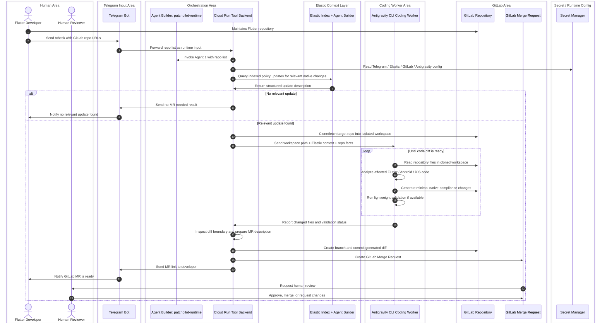

# Sequence Diagram - Telegram MVP with Antigravity

This is the hackathon MVP runtime flow. Repository input is provided at runtime
through Telegram. No MongoDB persistence is required.

This flow queries policy records that were already indexed by the separate
[policy ingestion flow](sequence-policy-ingestion.md). It should not crawl the
internet on every `/check` request.

